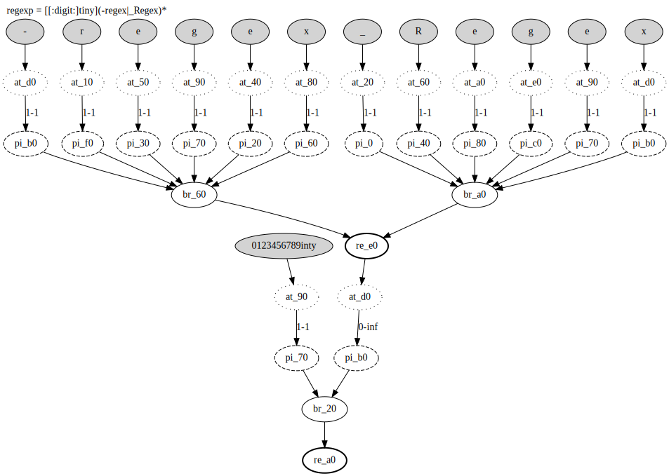
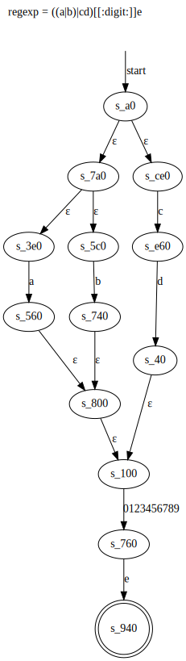

# tiny-regex

一个基本支持 ERE 语法的正则库（尚未完成，但可以生成 NFA 和 re-branch-piece-atom 树）

## 依赖

- `graphviz` 用于画图

```console
$ sudo apt install graphviz # for Debian or Ubuntu
$ sudo dnf install graphviz # for Fedora or CentOS
$ sudo pacman -S graphviz # for ArchLinux or Manjaro
```

- 一个可以查看矢量图的图片浏览器(或者一个现代浏览器)

## 构建

```console
$ ./build.sh
```

## 使用

```console
$ ./test.sh {regexp}
```

可以查看`./build/relationship.svg`文件，它包含了正则表达式编译的中间结果。



其中`re`代表`regex`，`br`代表`branch`，`pi`代表`piece`，`at`代表`atom`。连线上的`x-y`代表匹配次数区间。

上述名词的含义可以通过`man 7 regex`查询。

可以查看`./build/NFA.svg`文件，它包含了正则表达式编译出来的 NFA 图示。



## 缺陷

~~疯狂内存泄漏，暂时懒得管了。~~

现在使用了很丑陋的方式解决了内存泄漏问题。

## 文档编写中...

之后打算将正则转为 NFA 再转为 DFA ，因此要放弃实现一些特性。
